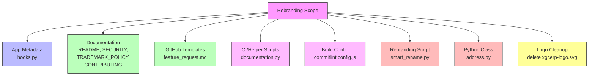

# Design Document

## Overview

This design covers the systematic rebranding of the ERP application from the old identity (XGC Software Inc. / XGCERP / xgccorp.com) to the new identity (Axina Group Inc. / AXERP / axinagroup.com). The scope is strictly limited to text replacements across 10 existing files plus the deletion of one stale logo file. No new modules, database schemas, APIs, or runtime logic are introduced.

The rebranding is a controlled find-and-replace operation with explicit protection for internal Python identifiers (`app_name = "erpnext"`, `erpnext_integrations`, `/assets/erpnext/` paths) that must remain unchanged to preserve imports and runtime behavior.

## Architecture

There is no architectural change. The existing Frappe app structure remains identical. The rebranding touches only:

1. **String literals** in configuration and metadata files
2. **URLs** pointing to the old domain
3. **Copyright headers** referencing the old company name
4. **One Python class name** (`XGCERPAddress` → `AXERPAddress`)
5. **One file deletion** (`xgcerp-logo.svg`)

## Components and Interfaces

### Replacement Map

The following global string replacements apply across all affected files unless a file-specific override is noted:

| Old Value | New Value | Context |
|-----------|-----------|---------|
| `XGCERP` | `AXERP` | Product brand name |
| `XGC CORP.` | `Axina Group Inc.` | Company name in copyright headers |
| `XGC Software Inc.` | `Axina Group Inc.` | Company name (if present) |
| `xgccorp.com` | `axinagroup.com` | Domain in all URLs |
| `docs.xgccorp.com` | `docs.axinagroup.com` | Documentation domain |
| `db@xgccorp.com` | `db@axinagroup.com` | Contact email |
| `XGCERPAddress` | `AXERPAddress` | Python class name |
| `xgcerp-logo.svg` | `axinagroup-logo.svg` | Logo filename reference |
| `https://github.com/XGCERP/xgcerp` | `https://github.com/AXERP/axerp` | Source link |

### Protected Identifiers (DO NOT CHANGE)

| Identifier | Location | Reason |
|------------|----------|--------|
| `app_name = "erpnext"` | `hooks.py` | Frappe app registry key |
| `erpnext_integrations` | `hooks.py`, `smart_rename.py` | Python module path |
| `/assets/erpnext/` | `hooks.py` | Asset serving paths |
| `erpnext.*` module paths | `hooks.py` | All Python import paths |

### File-by-File Changes

#### 1. `erpnext/hooks.py`

| Line/Section | Old | New |
|-------------|-----|-----|
| `app_title` | `"XGCERP"` | `"AXERP"` |
| `app_publisher` | `"XGC CORP."` | `"Axina Group Inc."` |
| `app_email` | `"db@xgccorp.com"` | `"db@axinagroup.com"` |
| `source_link` | `"https://github.com/XGCERP/xgcerp"` | `"https://github.com/AXERP/axerp"` |
| `extend_doctype_class` | `XGCERPAddress` | `AXERPAddress` |
| `default_mail_footer` | `XGCERP` | `AXERP` |
| Global Search comment | `# XGCERP doctypes` | `# AXERP doctypes` |
| `app_color` | `"#e74c3c"` | `"#f9720a"` |
| `app_name` | `"erpnext"` | **NO CHANGE** |
| All `/assets/erpnext/` paths | — | **NO CHANGE** |
| All `erpnext.*` module paths | — | **NO CHANGE** |
| `erpnext.erpnext_integrations.*` | — | **NO CHANGE** |

#### 2. `README.md`

| Target | Old | New |
|--------|-----|-----|
| All brand name occurrences | `XGCERP` | `AXERP` |
| Logo alt text | `XGCERP Logo` | `AXERP Logo` |
| Screenshot image URLs | `xgccorp.com/files/` | `axinagroup.com/files/` |
| Documentation link | `docs.xgccorp.com` | `docs.axinagroup.com` |
| Security link | `xgccorp.com/security` | `axinagroup.com/security` |

#### 3. `TRADEMARK_POLICY.md`

| Target | Old | New |
|--------|-----|-----|
| All brand name occurrences | `XGCERP` | `AXERP` |
| Company attribution | (Frappe-owned text — keep Frappe references) | Add `Axina Group Inc.` where XGC-related entities are referenced |

#### 4. `SECURITY.md`

| Target | Old | New |
|--------|-----|-----|
| Brand name | `XGCERP` | `AXERP` |
| Report URL | `xgccorp.com/security/report` | `axinagroup.com/security/report` |
| Guidelines URL | `xgccorp.com/security` | `axinagroup.com/security` |

#### 5. `.github/CONTRIBUTING.md`

| Target | Old | New |
|--------|-----|-----|
| All brand name occurrences | `XGCERP` | `AXERP` |

#### 6. `.github/ISSUE_TEMPLATE/feature_request.md`

| Target | Old | New |
|--------|-----|-----|
| Brand name | `XGCERP` | `AXERP` |
| Docs URL | `docs.xgccorp.com` | `docs.axinagroup.com` |
| Partners URL | `xgccorp.com/partners` | `axinagroup.com/partners` |

#### 7. `.github/helper/documentation.py`

| Target | Old | New |
|--------|-----|-----|
| `DOCUMENTATION_DOMAINS` list entry | `"docs.xgccorp.com"` | `"docs.axinagroup.com"` |

#### 8. `commitlint.config.js`

| Target | Old | New |
|--------|-----|-----|
| Copyright header comment | `XGC CORP.` | `Axina Group Inc.` |

#### 9. `scripts/smart_rename.py`

| Target | Old | New |
|--------|-----|-----|
| Copyright header | `XGC CORP.` | `Axina Group Inc.` |
| `OLD_BRAND` | `"ERPNext"` | `"XGCERP"` |
| `NEW_BRAND` | `"XGCERP"` | `"AXERP"` |
| `NEW_PUBLISHER` | `"XGC CORP."` | `"Axina Group Inc."` |
| `NEW_EMAIL` | `"db@xgccorp.com"` | `"db@axinagroup.com"` |
| `SOURCE_LOGO_NAME` | `"xgcerp-logo.svg"` | `"axinagroup-logo.svg"` |
| `source_link` in `update_hooks_metadata` | `"https://github.com/XGCERP/xgcerp"` | `"https://github.com/AXERP/axerp"` |
| `erpnext_integrations` preservation | — | **NO CHANGE** (keep existing logic) |

#### 10. `erpnext/accounts/custom/address.py`

| Target | Old | New |
|--------|-----|-----|
| Class name | `XGCERPAddress` | `AXERPAddress` |

#### 11. Logo File Cleanup

| Action | File |
|--------|------|
| **DELETE** | `xgcerp-logo.svg` (repo root) |
| **VERIFY EXISTS** | `axinagroup-logo.svg` (repo root) |

## Data Models

No data model changes. This rebranding affects only string literals in source files. No database migrations, no schema changes, no DocType modifications.

## Error Handling

| Error Condition | Handling |
|----------------|----------|
| A protected identifier (`app_name`, `erpnext_integrations`, `/assets/erpnext/`) is accidentally modified | Post-change verification tests catch this as a failure. The change must be reverted. |
| `xgcerp-logo.svg` does not exist at deletion time | Treat as a no-op (file may have already been removed). |
| `axinagroup-logo.svg` is missing from repo root | Flag as an error — the new logo must be present before rebranding proceeds. |
| Residual old brand strings remain after replacement | Post-change grep/search for `XGCERP`, `xgccorp.com`, `XGC CORP.` across affected files catches any missed replacements. |

## Testing Strategy

### PBT Applicability Assessment

Property-based testing is **not applicable** for this feature. The rebranding is a set of deterministic, static string replacements with no meaningful input variation. Every acceptance criterion is a SMOKE-level check: either the correct string is present or it isn't. There are no pure functions, no data transformations, no parsers, and no business logic being added or modified.

### Testing Approach: Smoke Tests

All 11 requirements map to simple file-content assertions. The testing strategy uses **smoke tests** — single-execution checks that verify the expected strings are present and the old strings are absent.

#### Test Categories

1. **Positive assertions** — verify new brand strings exist in each file
2. **Negative assertions** — verify old brand strings do NOT exist in each file
3. **Protected identifier assertions** — verify `app_name = "erpnext"`, `erpnext_integrations`, and `/assets/erpnext/` paths remain unchanged
4. **File existence checks** — verify `xgcerp-logo.svg` is deleted and `axinagroup-logo.svg` exists

#### Test Implementation

- Use Python's built-in `unittest` or `pytest` with simple file reads and string assertions
- Each test reads the target file and asserts `in` / `not in` for the relevant strings
- Tests are grouped by requirement (one test function per requirement, or one per file)
- No mocking, no fixtures, no external dependencies needed

#### Verification Checklist (per file)

For each affected file, the test suite verifies:
- [ ] Old brand string (`XGCERP`) is absent
- [ ] New brand string (`AXERP`) is present
- [ ] Old domain (`xgccorp.com`) is absent (where applicable)
- [ ] New domain (`axinagroup.com`) is present (where applicable)
- [ ] Protected identifiers are intact (for `hooks.py`)
